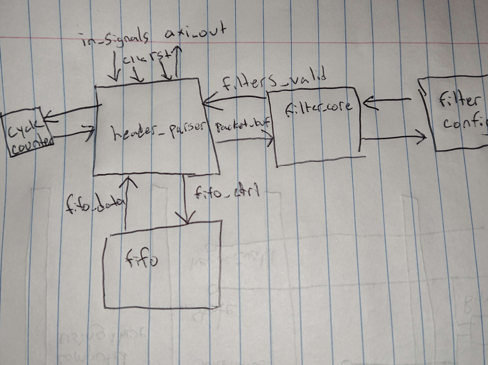
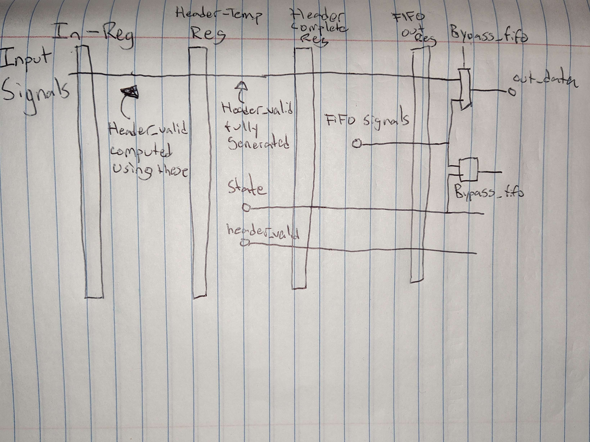
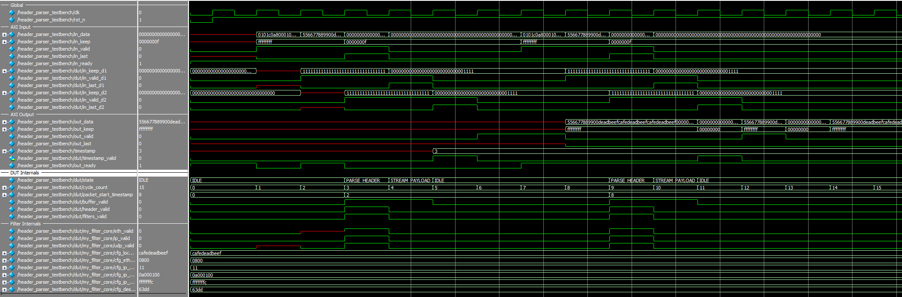
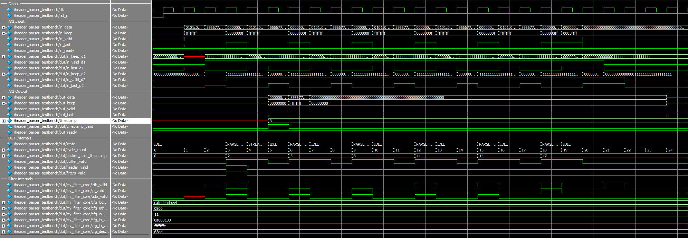

**AXI-Stream Header Parser Project Report**

**Overview** This document outlines the challenges, methodologies, and results of timing optimization for a 256-bit AXI-Stream header parser implemented on Intel's Arria 10 FPGA. The project was developed as a resume portfolio item, with the intent of demonstrating deep understanding of pipelining, timing closure, floorplanning, and synthesis control relevant to high-frequency trading (HFT) hardware applications.

---

**Design Summary**

- **Target Platform**: Intel Arria 10
- **Input Interface**: AXI-Stream, 256-bit width, LSB-first
- **Pipeline Depth**: 4 stages
- **Functional Goal**: Parse Ethernet/IP/UDP headers and timestamp incoming packets
- **Target FMax**: 350 MHz aspirational, >250 MHz required
- **Achieved FMax**: 251 MHz

---

**Early Design Strategy**

The initial implementation was deliberately kept purely combinational, with no pipeline registers, in order to make critical path bottlenecks visible early and to provide flexibility for inserting pipeline stages only where required. This clean separation allowed for cleaner timing budgeting and more deterministic pipelining of the header parsing and filter logic. Once bottlenecks became apparent, registers were introduced incrementally at clean stage boundaries.

This allowed:

- Clear visibility into logic delay without stage overlap
- Clean insertion of register boundaries between parsing, filtering, and control
- Precise alignment between FSM states and data validity

---

**Architecture and Pipeline Register Diagram**





The 4-stage pipeline is broken down as follows:

1. **Stage 1 - Input Registering**:
   - Input AXI-Stream signals (`in_data`, `in_keep`, `in_valid`, `in_last`) are registered into `*_d1` form.
   - Used to compute preliminary header-related values such as `buffer_valid`.

2. **Stage 2 - Header Analysis**:
   - Header information is assembled across two beats and passed to the filter logic.
   - `header_valid` is generated combinationally in this stage.

3. **Stage 3 - FSM and Stream Data Construction**:
   - FSM processes `header_valid` and determines next state (STREAM_PAYLOAD or flush).
   - `stream_*` outputs are generated for either FIFO or bypass logic.

4. **Stage 4 - Output Registering**:
   - `stream_*` outputs are registered.
   - Output mux logic selects between FIFO and stream pipeline paths.

This breakdown ensures clear separation of compute, control, and flow logic, enabling modular timing optimization and simplifying RTL debug.

---

**Challenges Encountered**

1. **Slow Critical Paths from IO Buffers**
   - Initial worst-case paths were from `in_valid` and `in_keep` IO buffers to their first pipeline registers (`*_d1`), with delays exceeding 7.5 ns due to long interconnect (IC) and poor placement.
   - Placement was unconstrained, resulting in registers landing far from their IO buffers.

2. **Timing Analysis Failures on Virtual Outputs**
   - Output pins (e.g., `out_valid`) were showing up as critical paths in reports, despite not being relevant to internal pipeline timing.
   - Attempts to apply `set_output_delay 0` gave me trouble - I ended up setting these as false paths.

3. **FSM and Header Alignment Issues**
   - The FSM used for packet parsing depended on `header_valid`, which was generated 2 pipeline stages later, causing timing and alignment ambiguity.
   - Pipeline synchronization between FSM logic and downstream `stream_*` signals required careful staging and realignment.

4. **Seed Variability**
   - Significant FMax variation across seeds. Seed 1 could yield 200 MHz, while seed 4 reached 251 MHz.
   - Needed a way to programmatically identify and reuse the best seed.

5. **Quartus Scripting Limitations**
   - `--export_assignments` was unavailable in Quartus Standard.
   - `get_report_panel_data` initially failed due to missing `Timing Analyzer Summary` panel, stemming from SDC omissions.

---

**Solutions Implemented**

1. **Manual IO + Register Placement with LogicLock**
   - Identified active IO buffer regions in Chip Planner (Y-coordinates 33, 61, 88, 115, 142, 169, 196 on column 141).
   - Wrote TCL scripts to align `in_data[*]`, `in_keep[*]`, `in_valid`, and `in_last` to those IO buffer rows.
   - Placed corresponding `_d1` registers in columns 139–140 to minimize IC delays.

2. **Pipeline Registering and Forwarding Cleanup**
   - Ensured all FSM-related signals were staged 2–3 cycles to match header validation timing.
   - Refactored combinational blocks to read from `*_d1/d2/d3` versions of all timing-sensitive signals.

3. **Quartus Tcl Automation and Seed Sweeping**
   - Created a `sweep_seeds_and_lock.tcl` script to run `quartus_map`, `quartus_fit`, `quartus_sta` for N seeds.
   - Automatically parsed slack using a generated `get_slack_temp.tcl` that opened the project and extracted slack from STA reports.
   - Once the best seed was found, regenerated placement and applied `PLACEMENT_LOCK ON` for each instance.

4. **Placement Lock Export Fixes**
   - Replaced `--export_assignments` with a `quartus_cdb -t` call to a generated `export_placement.tcl`:
     ```tcl
     project_open header_parser -revision header_parser
     write_assignment_file -file best_seed_placement.qsf
     project_close
     ```

5. **Slack Panel Fallback and Debugging**
   - Enhanced script to dump available report panels.
   - Fallback to safer slack extraction logic with warnings if `Timing Analyzer Summary` not found.

6. **Resume Optimization and Labeling**
   - Final synthesis performance: **251 MHz @ 256-bit datapath (~64.3 Gbps)**
   - Best seed locked into `header_parser.qsf` using:
     ```tcl
     set_global_assignment -name FITTER_SEED 4
     source best_seed_placement.qsf
     ```

---

**Attempted Manual Optimization in Quartus Standard**

In an effort to further refine placement and squeeze out additional MHz, manual locking was attempted using Chip Planner and Tcl scripting. However, Quartus Standard presents several roadblocks:

- Chip Planner lacks full support for exporting netlist-based placement data
- Tcl commands like `get_nodes`, `get_node_info`, and `get_names` vary between GUI, CLI, and Chip Planner contexts, often producing errors or empty results
- LogicLock regions in Standard Edition do not enforce fixed placement without additional per-instance `PLACEMENT_LOCK` commands
- Post-fit netlist interaction is limited; verifying true register placement programmatically is cumbersome

Additionally, even with ideal manual placement, some input-to-register paths (e.g., `in_keep[29] → in_keep_d1[27]`) still exhibited 3.2–3.5 ns delays due to IO buffer architecture and routing on Arria 10. These delays are near the edge of what is tolerable for a 350 MHz clock (2.86 ns period), making the original FMax target impractical on this device without risking unstable timing. A board with faster IO support, such as a Stratix 10, would be more appropriate for 350+ MHz applications.

Ultimately, given diminishing returns and hardware limits, the final design was fixed at 251 MHz.

---

**Test Coverage and Validation**




Test cases included:
- Full 2-word AXI-Stream headers with valid/invalid `keep` patterns
- Early `in_last` termination (short packet)
- Proper FIFO bypass activation when out_ready is high
- Packets dropped when malformed header detected
- Filtering tests using `filter_core` configuration registers

Each scenario was verified in ModelSim using waveform captures to confirm FSM state transitions and output behavior.


---

**Conclusion** This project demonstrates the full optimization loop of a high-performance packet processing module, from RTL through fitter timing closure. It greatly improved my understanding of pipelining, synchronization, floorplanning, slack debugging, Quartus scripting, and build reproducibility.
